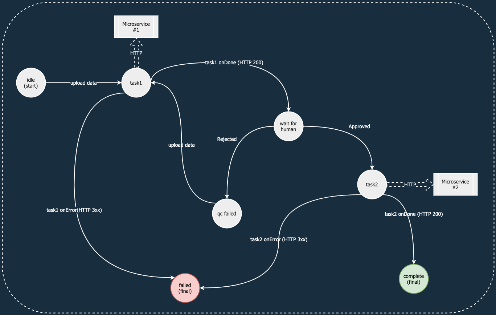

<h1 align="center">Welcome to microflow 👋</h1>
<p>
  <a href="https://www.npmjs.com/package/microflow" target="_blank">
    
  </a>
  <a href="https://github.com/krn0x2/microflow#readme" target="_blank">
    
  </a>
  <a href="https://github.com/krn0x2/microflow/graphs/commit-activity" target="_blank">
    
  </a>
  <a href="https://github.com/krn0x2/microflow/blob/master/LICENSE" target="_blank">
    
  </a>
</p>

> Finite state machine based HTTP microservice orchestration

### 🏠 [Homepage](https://github.com/krn0x2/microflow#readme)

## Purpose

Microflow helps you build and run complex workflows which are composed of HTTP microservices and manual (human moderator) stages, all by definiing a JSON workflow blueprint. It is built on robust concepts of __finite state machine__, and allows you to control input/output data as template variables (think jsonpath, handlebars).
A workflow consists of manual states and __task__ states (aka HTTP workers which could be sync/async).



## Install
npm
```sh
npm i --save microflow@alpha
```

## Documentation

The `Microflow` class provides various methods to author/execute/infer workflow and workflow instances

```javascript
import { Microflow } from "microflow";

const flow = new Microflow({
  jwt: {
    secretOrPublicKey: 'dummySecretKey',
    sign: {
      expiresIn: '1h'
    }
  }
});

const {
  // task interface
  task,
  // workflow interface
  workflow,
  // execution interface
  execution,
} = flow;
```

## Usage

```javascript
import { Microflow } from "microflow";

const flow = new Microflow({
  // bring your own persistence here 
  // (implements MicroflowStorage)
  storage: undefined,
  jwt: {
    secretOrPublicKey: 'dummySecretKey',
    sign: {
      expiresIn: '1h'
    }
  }
});

// Authoring task and workflow

// Register a task
const task = await flow.task.create({
  // Recognisiable identified for the task
  id: "airflow",
  // type of task (only 'http' supported right now)
  type: "http",
  //  <AxiosRequestConfig> supported (https://github.com/axios/axios/blob/master/index.d.ts#L44)
  config: {
    url: "http://localhost:1000/api/experimental/dags/{{dagId}}/dag_runs",
    headers: {
      "Cache-Control": "no-cache",
      "Content-Type": "application/json"
    },
    data: "$.data",
    method: "post"
  }
});

const { id: taskId } = await task.data();

// Create a workflow
const workflow = await flow.workflow.create({
  id: 'sample',
  config: {
    initial: 'auto_test_1',
    states: {
      auto_test_1: {
        type: 'task',
        taskId,
        parameters: {
          dagId: 'dag1',
          data: '$'
        },
        resultSelector: {
          foo: 'bar',
          baz: 'har',
          message: '$.message',
          dag_execution_date: '$.execution_date'
        },
        resultPath: '$.pipeline1.apiResponse',
        onDone: {
          target: 'ready_for_approval',
          resultSelector: {
            a: 'a',
            b: 'b',
            out: '$'
          },
          resultPath: '$.pipeline1.success'
        },
        onError: {
          target: 'failed',
          resultSelector: {
            c: 'c',
            d: 'd',
            out: '$'
          },
          resultPath: '$.pipeline1.error'
        }
      },
      ready_for_approval: {
        type: 'atomic',
        on: {
          reject: {
            target: 'failed',
            resultPath: '$.reject.data'
          },
          approve: {
            target: 'auto_test_2',
            resultPath: '$.approval.data'
          }
        }
      },
      auto_test_2: {
        type: 'task',
        taskId,
        parameters: {
          dagId: 'dag2',
          data: '$'
        },
        resultSelector: {
          foo: 'bar',
          baz: 'har',
          message: '$.message',
          dag_execution_date: '$.execution_date'
        },
        resultPath: '$.pipeline2.apiResponse',
        onDone: {
          target: 'done',
          resultSelector: {
            e: 'e',
            out: '$'
          },
          resultPath: '$.pipeline2.success'
        },
        onError: {
          target: 'failed',
          resultSelector: {
            f: 'f',
            out: '$'
          },
          resultPath: '$.pipeline2.error'
        }
      },
      done: {
        type: 'final'
      },
      failed: {
        type: 'final'
      }
    }
  }
});

// start an execution with initial data
const execution = await workflow.start({
  input1: 'val1',
  input2: 'val2'
});

// Sending events to an execution
await execution.send({
  type: 'success-auto_test_1',
  data: {
    test_a_result: true,
    test_b_result: false
  }
});

await execution.send({
  type: 'approve',
  data: {
    message: 'The acceptance test was fine'
  }
});

await execution.send({
  type: 'success-auto_test_2',
  data: {
    test_c_result: true
  }
});

const { completed, output, state } = await execution.describe();

console.log(output, completed, state);

```
## Storage

```javascript
import { Microflow } from "microflow";
import { MicroflowStorage } from "microflow/types";

// define your own storage from MicroflowStorage abstract class
class MyStorage implements IMicroflowStorage {
  workflow: ICrudable<IWorkflow>;
  task: ICrudable<ITask>;
  execution: ICrudable<IExecution>;
  // define CRUD functions
  constructor(){
    this.workflow = {
      //define CRUD implementation here
    }

    this.task = {
      //define CRUD implementation here
    }

    this.execution = {
      //define CRUD implementation here
    }
  }
}


const store = new MyStorage();

// create an instance of microflow with custom store injected
const flow = new Microflow({
  storage: store,
  jwt: {
    secretOrPublicKey: 'dummySecretKey',
    sign: {
      expiresIn: '1h'
    }
  }
});
```

## Examples

Navigate to `examples/basic` to run a sample express project with ephemeral storage.

## Run tests

```sh
npm run test
```

## Author

👤 **Karan Chhabra**

* Github: [@krn0x2](https://github.com/krn0x2)
* LinkedIn: [@krn0x2](https://linkedin.com/in/krn0x2)

## 🤝 Contributing

Contributions, issues and feature requests are welcome!<br />Feel free to check [issues page](https://github.com/krn0x2/microflow/issues). You can also take a look at the [contributing guide](https://github.com/krn0x2/microflow/blob/master/CONTRIBUTING.md).

## Show your support

Give a ⭐️ if this project helped you!

## 📝 License

Copyright © 2020 [Karan Chhabra](https://github.com/krn0x2).<br />
This project is [MIT](https://github.com/krn0x2/microflow/blob/master/LICENSE) licensed.
